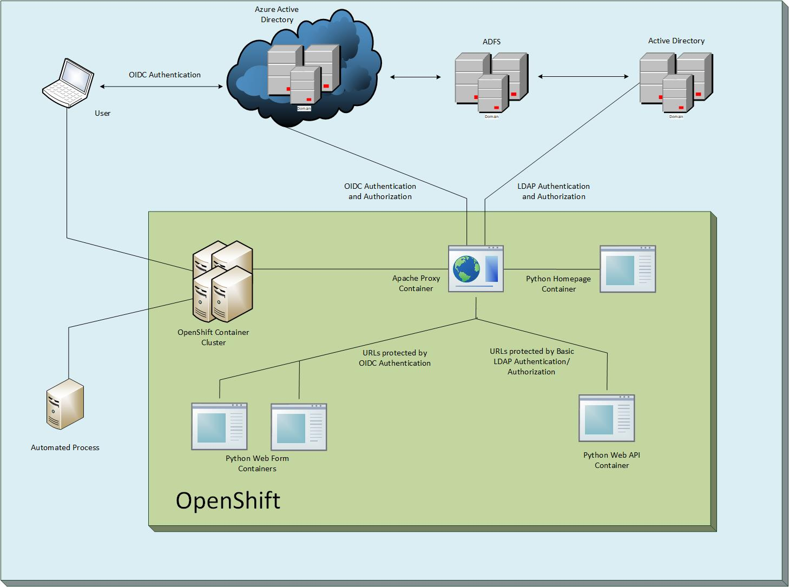
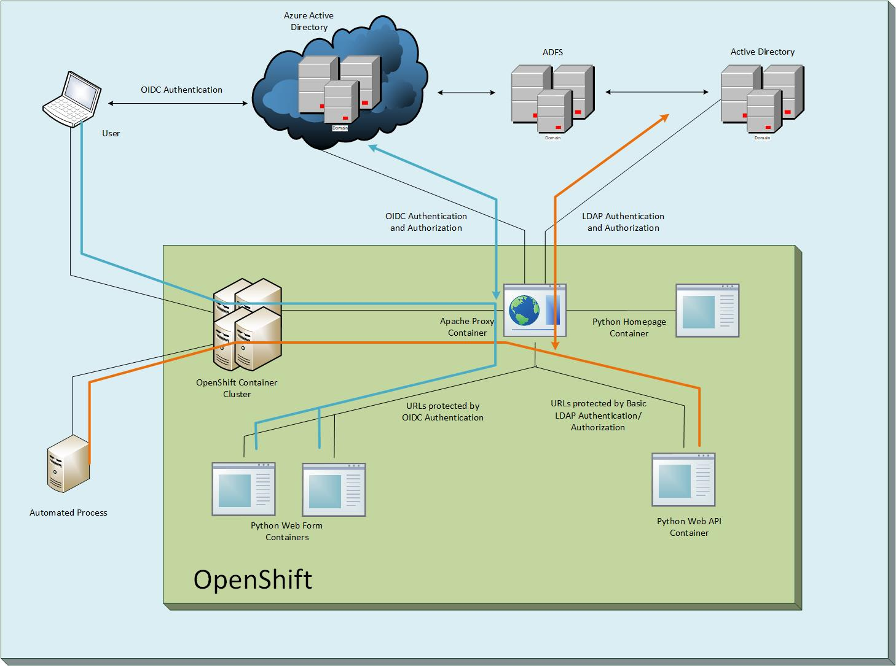

# Apache Proxy
# OpenID Connect (OIDC) Authentication/Authorization for WebApp
# Basic LDAP Authentication/Authorization for API
### An example of how to use a reverse proxy to provide OIDC authentication in front of an arbitrary web application, while using Azure roles to manage authorization
#### See [Microsoft Page](https://docs.microsoft.com/en-us/azure/active-directory/develop/v1-protocols-openid-connect-code) for more details.
#### This example contains two containers (1) An Apache web server, and (2) a Python application running in Flask.
#### Apache Proxy container in this project, Flask WebApp in [azure-auth-flask-webapp](https://github.com/spidermonkey2012/azure-auth-flask-webapp)

#### Diagram


#### Authentication Flow



The OpenShift cluster exposes a route for users to reach the Apache (reverse_proxy) application.
Apache uses OIDC to authenticate users against Azure AD and also determines which application roles they have been assigned.
Once the user is authenticated and/or authorized Apache passes their traffic back to the Flask application (app_server).
Basic access to the application only requires that a user be authenticated.  However, traffic to /admin requires that the user be assigned the appadmin role.
In this simple example both paths just display a "Hello, World!" message once you have been authenticated and/or authorized.


### Installation


Some familiarity with OpenShift is assumed. 

1. Build the two container images
  * In the OpenShift console select Add to Project => Browse Catalog.
  * Select Apache HTTP Server (httpd)
  * Choose a short, memorable name for your example (e.g. dpd-reverse-proxy), paste the URL of this GIT Prject, and click create.
  * Add GIT_SSL_NO_VERIFY as true. Builds => name => Environment
  * FYI, your container will likely fail during the first build while we are getting everything configured properly.  Don't worry.
  * Then edit the YAML and change from "Source" build strategy to a "Docker" build strategy.  Actions => Edit YAML. 

```json
...
  strategy:
    dockerStrategy:    <- originally "sourceStrategy:"
      env:
        - name: GIT_SSL_NO_VERIFY
          value: 'true'
...
    type: Docker       <- originally "Type: Source"
```

2. Deploy both container images in a single pod
  * Add OIDC_SECRET_KEY, OIDC_APP_ID, and CALLBACK_URL environment variables to the build and but leave them empty for now, and add proxy settings to the deployment environment.  Applications => Deployments => name => Environment
  * HTTP_PROXY = http://hostname.domain.com:8080/
  * HTTPS_PROXY = http://hostname.domain.xom.com:8080/
  * NO_PROXY = .domain.com,localhost,.localdomain.com
  * These settings let the running container reach Azure AD in the cloud.

3. Create a route for the reverse proxy service.  Applications => Services => name => Actions => Create Route
  * Enter a name for the route.  The full URL will be automatically generated for you when you save.
  * Make sure to tick the box for secure route. Click Create.
  * Capture the full route URL, as you will need it going forward.  Applications => Routes

4. Visit [portal.azure.com](https://portal.azure.com/) and register a new application
  * Azure Active Directory => App Registrations => New Application Registration
  * Give your app a name and include the full route URL that you just created.
  * Make sure to capture the Application ID for later use.
  * Visit Settings => Keys and generate a new secret key. Just type in a name, choose an expiration, and click save.  It will display a key.  Make sure to capture it for later use.
  * Visit Reply URLs and make sure the entry is something like https://my-app.openshift.domain.com/web/callback. The URL needs to be behind the OIDC protected path, but not a real URL path that you have configured on your Flask WebApp.
  * Add an application role by clicking the Manifest button and replacing the appRoles section:
```json
...
  "appRoles": [
    {
      "allowedMemberTypes": [
        "User"
      ],
      "displayName": "AppAdmin",
      "id": "xxxxxxxx-xxxxx-xxxxx-xxx-xxxxxxx",
      "isEnabled": true,
      "description": "Admins who can access secure areas",
      "value": "AppAdmin"
    },
    {
      "allowedMemberTypes": [
        "User"
      ],
      "displayName": "AppPrivUser",
      "id": "xxxxxxxx-xxxxx-xxxxx-xxx-xxxxxxx",
      "isEnabled": true,
      "description": "Users who can access privileged areas",
      "value": "AppPrivUser"
    },
    {
      "allowedMemberTypes": [
        "User"
      ],
      "displayName": "AppUser",
      "id": "xxxxxxxx-xxxxx-xxxxx-xxx-xxxxxxx",
      "isEnabled": true,
      "description": "Users who can access",
      "value": "AppUser"
    },
  ],
...
```
  * Replace the id GUID with your own custom generated GUID. You can use any Linux machine to run command "uuidgen" or [Handy online GUID generator](https://www.guidgenerator.com/online-guid-generator.aspx)
  * Once you have saved, you can add a user to the role. I recommend using your own ID for the initial testing.  Visit Azure Active Directory => Enterprise Applications => your app => Users and Groups => Add User
  * Select a user and then assign the appadmin role.

5. Update the reverse_proxy build config and rebuild the image
  * Builds => name => Environment
  * Enter the OIDC_APP_ID (application ID from app registration)
  * Enter the OIDC_SECRET_KEY (secret generated during app registration)
  * Enter the fqdn for the CALLBACK_URL.    Should just be something like https://my-app.openshift.domain.com/web/callback
  * Save and trigger a new build if one does not start automatically.

6. Testing it out
  * If your new build succeeded and you did everything right, the application will automatically deploy the latest image.
  * Click on the route to test everything out!  You should be bounced to Azure for a permission check and authentication and redirected back to the "Hello, World!" flask app.
  * Now add /admin to the end of the address and see if it still lets you in.  If your ID has the appadmin role, it should.  Anyone else should get an access error.

### Background


Several different components and technologies come together to make this example work.  However, none of them are particularly cutting edge or special.
* Apache is just a generic web server. It has well established modules that add both proxy support and OpenID Connect functionallity.
* Flask is a web server for Python apps. You could swap this out for any other web based application.
* OpenShift provides a convenient test environment for people to play with the code, but you could easily deploy this code to a different container platform, or even a physical or virtual server if required.
* Azure is ExxonMobil's preferred cloud provider and is a convenient identity and authentication provider, but really any OIDC compliant provider can be used. 


#### I recommend reviewing the supplied Dockerfiles if you are interested in how the containers are built

#### If you get authentication / OIDC errors double check your CALLBACK_URL and proxy settings and all your environment variables.
